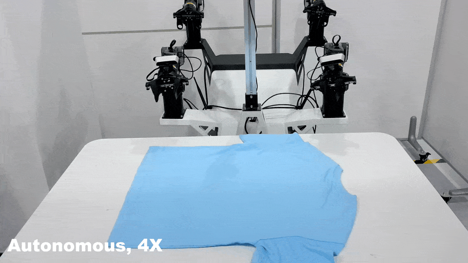
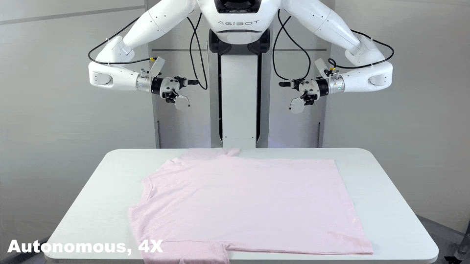
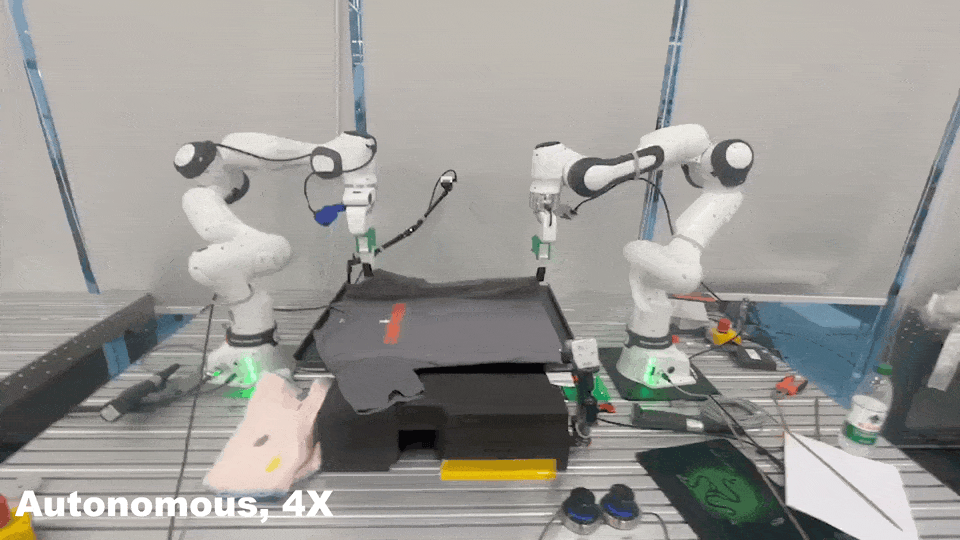

<div id="top" align="center">


<a href="https://opendrivelab.com/OpenGO1/" target="_blank">Research Blog: GO-1 Open-sourcing</a> | <a href="https://opendrivelab.com/blog/agibot-world/" target="_blank">Research Blog: AgiBot World Colosseo</a> | <a href="https://arxiv.org/abs/2503.06669" target="_blank">Technical Report</a>

<a href="https://arxiv.org/abs/2503.06669">"></a> [](https://huggingface.co/agibot-world) [](https://agibot-world.com) [](https://creativecommons.org/licenses/by-nc-sa/4.0/)
<a href="https://docs.google.com/spreadsheets/d/1GWMFHYo3UJADS7kkScoJ5ObbQfAFasPuaeC7TJUr1Cc/edit?usp=sharing"></a> [](https://huggingface.co/agibot-world/GO-1)

</div>

AgiBot World Colosseo is a full-stack large-scale robot learning platform curated for advancing bimanual manipulation in scalable and intelligent embodied systems. It is accompanied by foundation models, benchmarks, and an ecosystem to democratize access to high-quality robot data for the academic community and the industry, paving the path towards the "ImageNet Moment" for Embodied AI.

We have released:
- **<a href="https://huggingface.co/agibot-world/GO-1" target="_blank">GO-1</a>:** Our robotic foundation model pretrained on AgiBot World Dataset
- **<a href="https://huggingface.co/agibot-world/GO-1-Air" target="_blank">GO-1 Air</a>:** GO-1 model without Latent Planner, high-performanced and lightweighted
- **<a href="https://docs.google.com/spreadsheets/d/1GWMFHYo3UJADS7kkScoJ5ObbQfAFasPuaeC7TJUr1Cc/edit?usp=sharing" target="_blank">Task Catalog</a>:** Reference sheet outlining the tasks in our dataset, including robot end-effector types, sample action-text descriptions and more
- **<a href="https://huggingface.co/datasets/agibot-world/AgiBotWorld-Beta" target="_blank">AgiBot World Beta</a>:** Our complete dataset featuring 1,003,672 trajectories (~43.8T)
- **<a href="https://huggingface.co/datasets/agibot-world/AgiBotWorld-Alpha" target="_blank">AgiBot World Alpha</a>:** A curated subset of AgiBot World Beta, containing 92,214 trajectories (~8.5T)

## News📰 <a name="news"></a>

> [!IMPORTANT]
> 🌟 Stay up to date at [opendrivelab.com](https://opendrivelab.com/#news)!

- **`[2025/09/19]`** 🚀 **Our robotic foundation model GO-1 open-sourced.**
- **`[2025/03/10]`** 📄 <a href="https://opendrivelab.com/blog/agibot-world/" target="_blank">Research Blog</a> and <a href="https://arxiv.org/abs/2503.06669" target="_blank">Technical Report</a> released.
- **`[2025/03/01]`** Agibot World Beta released.
- **`[2025/01/03]`** <span style="color: #B91C1C; font-weight: bold;">Agibot World Alpha Sample Dataset released.</span>
- **`[2024/12/30]`** 🤖 Agibot World Alpha released.

## TODO List 📅 <a name="todolist"></a>

- [x] **AgiBot World Alpha**
- [x] **AgiBot World Beta**
  - [x] ~1,000,000 trajectories of high-quality robot data 
- [x] **AgiBot World Foundation Model: GO-1**
  - [x] GO-1 fine-tuning script
  - [x] GO-1 Air pre-trained checkpoint
  - [x] GO-1 pre-trained checkpoint
  - [x] Examples of using GO-1 model
- [x] **2025 AgiBot World Challenge**

## Key Features 🔑 <a name="keyfeatures"></a>

- **1 million+** trajectories from 100 robots.
- **100+ 1:1 replicated real-life scenarios** across 5 target domains.
- **Cutting-edge hardware:** visual tactile sensors / 6-DoF Dexterous hand / mobile dual-arm robots
- **Wide-spectrum versatile challenging tasks**
- **General robotic policy pretrained on AgiBot World**

<div style="max-width: 100%; overflow-x: auto; margin: 0 auto; !important;">
  <table style="border-collapse: collapse; border-spacing: 0; width: 100%; table-layout: fixed;">
    <tr style="border: none;">
      <td align="center" style="border: none; padding: 10px;">
        
        <p><b>Contact-rich Manipulation</b></p>
      </td>
      <td align="center" style="border: none; padding: 10px;">
        
        <p><b>Long-horizon Planning</b></p>
      </td>
      <td align="center" style="border: none; padding: 10px;">
        
        <p><b>Multi-robot Collaboration</b></p>
      </td>
    </tr>
    <tr style="border: none;">
      <td align="center" style="border: none; padding: 10px;">
        
        <p><b>Fold Shirt (AgileX)</b></p>
      </td>
      <td align="center" style="border: none; padding: 10px;">
        
        <p><b>Fold Shirt (AgiBot G1)</b></p>
      </td>
      <td align="center" style="border: none; padding: 10px;">
        
        <p><b>Fold Shirt (Dual Franka)</b></p>
      </td>
    </tr>
  </table>
</div>

## Table of Contents

- [News📰 ](#news-)
- [TODO List 📅 ](#todo-list--)
- [Key Features 🔑 ](#key-features--)
- [Table of Contents](#table-of-contents)
- [Getting started 🔥 ](#getting-started--)
  - [Installation ](#installation-)
  - [How to Get Started with Our AgiBot World Data ](#how-to-get-started-with-our-agibot-world-data-)
    - [Download Datasets ](#download-datasets-)
    - [Visualize Datasets ](#visualize-datasets-)
  - [How to Get Started with Our GO-1 Model ](#how-to-get-started-with-our-go-1-model-)
    - [Requirements ](#requirements-)
    - [Model Zoo ](#model-zoo-)
    - [Fine-tuning on Your Own Dataset ](#fine-tuning-on-your-own-dataset-)
    - [Testing Your Model ](#testing-your-model-)
    - [More Examples ](#more-examples-)
- [License and Citation📄   ](#license-and-citation---)

## Getting started 🔥 <a name="gettingstarted"></a>

### Installation <a name="installation"></a>

1. Download our source code:
```bash
git clone https://github.com/OpenDriveLab/AgiBot-World.git
cd AgiBot-World
```

2. Create a new conda environment:
```bash
conda create -n go1 python=3.10 -y
conda activate go1
```

3. Install dependencies:
> This project is built on [LeRobot](https://github.com/huggingface/lerobot) (**dataset `v2.1`, commit `2b71789`**)  
> ⚡️ Our environment has been tested with **CUDA 12.4**.
```bash
pip install -e .
pip install --no-build-isolation flash-attn==2.4.2
```

If you encounter out of RAM issue while installing [flash attention](https://github.com/Dao-AILab/flash-attention?tab=readme-ov-file#installation-and-features), you can set the environment variable `MAX_JOBS` to limit the number of parallel compilation jobs:
```bash
MAX_JOBS=4 pip install --no-build-isolation flash-attn==2.4.2
```

### How to Get Started with Our AgiBot World Data <a name="startdata"></a>

#### Download Datasets <a name="downloaddatasets"></a>

- [OPTION 1] Download data from our [OpenDataLab](https://opendatalab.com/OpenDriveLab/AgiBot-World) page.

```bash
pip install openxlab # install CLI
openxlab dataset get --dataset-repo OpenDriveLab/AgiBot-World # dataset download
```

- [OPTION 2] Download data from our [HuggingFace](https://huggingface.co/datasets/agibot-world/AgiBotWorld-Alpha) page.

```bash
huggingface-cli download --resume-download --repo-type dataset agibot-world/AgiBotWorld-Alpha --local-dir ./AgiBotWorld-Alpha
```

Convert the data to **LeRobot Dataset** format following [any4lerobot](https://github.com/Tavish9/any4lerobot).

#### Visualize Datasets <a name="visualizedatasets"></a>

We adapt and extend the dataset visualization script from [LeRobot Project](https://github.com/huggingface/lerobot/blob/main/lerobot/scripts/visualize_dataset.py):

```bash
python scripts/visualize_dataset.py --task-id 390 --dataset-path /path/to/lerobot/format/dataset
```

It will open `rerun.io` and display the camera streams, robot states and actions, like this:
<div style="text-align: center;">

</div>

### How to Get Started with Our GO-1 Model <a name="startmodel"></a>

#### Requirements <a name="requirements"></a>

We strongly recommend full fine-tuning for the best performance. However, if GPU memory is limited, you can alternatively fine-tune only the Action Expert.

|         Usage         |  GPU Memory Required  |     Example GPU     |
| :-------------------: | :-------------------: | :-----------------: |
|       Inference       |         ~7GB          |      RTX 4090       |
|  Fine-tuning (Full)   | ~70GB (batch size=16) |   A100 80GB, H100   |
| Fine-tuning (Only AE) | ~24GB (batch size=16) | RTX 4090, A100 40GB |

#### Model Zoo <a name="modelzoo"></a>

|  Model   |                   HF Link                    |                              Description                              |
| :------: | :------------------------------------------: | :-------------------------------------------------------------------: |
| GO-1 Air | https://huggingface.co/agibot-world/GO-1-Air | GO-1 model without Latent Planner pre-trained on AgiBot World dataset |
|   GO-1   |   https://huggingface.co/agibot-world/GO-1   |            GO-1 model pre-trained on AgiBot World dataset             |

#### Fine-tuning on Your Own Dataset <a name="finetune"></a>

Here we provide an example of fine-tuning the GO-1 model on the [LIBERO](https://libero-project.github.io/intro.html) dataset. You can easily adapt it for your own data.

**1. Prepare Data**

We use the LeRobot dataset for our default dataset and dataloader. We provide a script for converting LIBERO to LeRobot format in [evaluate/libero/convert_libero_data_to_lerobot.py](evaluate/libero/convert_libero_data_to_lerobot.py).

Since TensorFlow is required to read the [RLDS format](https://github.com/google-research/rlds), we recommend creating a separate conda environment to avoid package conflicts:

```bash
conda create -n libero_data python=3.10 -y
conda activate libero_data

pip install -e ".[libero_data]"
```

Download the raw LIBERO dataset from [OpenVLA](https://huggingface.co/datasets/openvla/modified_libero_rlds), then run the script to convert it into LeRobot dataset:

```bash
# Optional: Change the LeRobot home directory
export HF_LEROBOT_HOME=/path/to/your/lerobot

python evaluate/libero/convert_libero_data_to_lerobot.py --data_dir /path/to/your/libero/data
```

**2. Prepare Configs**

We provide an example config for fine-tuning GO-1 on LIBERO in [go1/configs/go1_sft_libero.py](go1/configs/go1_sft_libero.py).

Key sections in the config:
- `DatasetArguments` - path or repo for the LeRobot dataset.
- `GOModelArguments` - model settings: architecture (GO-1 Air or GO-1), action chunk size, diffusion scheduler, parameter freezing, etc.
- `GOTrainingArguments` - training hyper-parameters, see [transformers docs](https://huggingface.co/docs/transformers/main_classes/trainer#transformers.TrainingArguments) for more details.
- `SpaceArguments` - state/action dimensions, data keys in the LeRobot dataset, default language prompt, control frequency.

See [go1/configs/go1_base_cfg.py](go1/configs/go1_base_cfg.py) for all available config options.

**3. Start Fine-tuning**

Start fine-tuning with the following command, you can setup environment variables according to the [shell](go1/shell/train.sh).

```bash
RUNNAME=<YOUR_RUNNAME> bash go1/shell/train.sh /path/to/your/config
```

Checkpoints will be saved in `experiment/<YOUR_RUNNAME>` and logs will be saved in `experiment/<YOUR_RUNNAME>/logs`.

**Notes:**
- We also provide a [debugging shell](go1/shell/train_dev.sh) which can run on a single RTX4090. It also set `DEBUG_MODE` to true for faster init. 
- We do not need to precompute the normalization statistics for the training data, as LeRobot will compute them when loading the dataset. The statistics will be saved to `experiment/<YOUR_RUNNAME>/dataset_stats.json`.
- We set action chunk size and control frequency input as 30 in GO-1 pre-training, as our AgiBot World dataset is collected at 30Hz. We change them to 10 in LIBERO fine-tuning, as the LIBERO dataset is collected at 10Hz. You can change them accordingly in the config file.


#### Testing Your Model <a name="inference"></a>

**Local Inference**

After fine-tuning, you can test your model locally using an example script in [evaluate/deploy.py](evaluate/deploy.py). You can build a `GO1Infer` object to load the model and dataset statistics, then call the `inference` method to run inference:

```python
import numpy as np
from evaluate.deploy import GO1Infer

model = GO1Infer(model_path="/path/to/your/checkpoint", data_stats_path="/path/to/your/dataset_stats.json")

payload = {
    "top": ...,
    "right": ...,
    "left": ...,
    "instruction": "example instruction",
    "state": ...,
    "ctrl_freqs": np.array([30]),
}

actions = model.inference(payload)
```

We also provide a script for open-loop evaluation with training data in [evaluate/openloop_eval.py](evaluate/openloop_eval.py).

**Remote Inference**

Considering that 1. real robot may not have powerful GPUs, 2. different robots and simulation benchmarks often require different package dependencies, we also provide a policy server for GO-1. A client in another environment or another machine send observations to the server for remote inference.

Start the server and it will listen on port `PORT` and waits for observations:

```bash
python evaluate/deploy.py --model_path /path/to/your/checkpoint --data_stats_path /path/to/your/dataset_stats.json --port <PORT>
```

For the client, we provide a `GO1Client` class to send requests to the server and receive actions:

```python
from typing import Dict, Any

import json_numpy
import numpy as np
import requests

json_numpy.patch()

class GO1Client:
  def __init__(self, host: str, port: int):
      self.host = host
      self.port = port

  def predict_action(self, payload: Dict[str, Any]) -> np.ndarray:
      response = requests.post(
          f"http://{self.host}:{self.port}/act", json=payload, headers={"Content-Type": "application/json"}
      )

      if response.status_code == 200:
          result = response.json()
          action = np.array(result)
          return action
      else:
          print(f"Request failed, status code: {response.status_code}")
          print(f"Error message: {response.text}")
          return None
```

We can then run the LIBERO evaluation script to query the server, see the [LIBERO README](evaluate/libero/README.md) for details.


#### More Examples <a name="examples"></a>
We will provide more examples of fine-tuning and running inference with GO-1 models on real robots and simulation platforms.

Currently we have:
- [Genie Studio](https://genie.agibot.com/geniestudio): AgiBot G1 with out-of-the-box GO-1 model plus integrated data collection, fine-tuning, and deployment pipeline.
- [AgileX](evaluate/agilex/README.md): AgileX Cobot Magic (Aloha)
- [LIBERO](evaluate/libero/README.md): LIBERO Simulation (Franka)
- [RoboTwin](https://github.com/RoboTwin-Platform/RoboTwin/tree/main/policy/GO1): RoboTwin Simulation (Aloha)

<!-- <p align="right">(<a href="#top">back to top</a>)</p> -->


<!-- <p align="right">(<a href="#top">back to top</a>)</p> -->


## 📄 License and Citation   <a name="liscenseandcitation"></a>

All the data and code within this repo are under [CC BY-NC-SA 4.0](https://creativecommons.org/licenses/by-nc-sa/4.0/). 

- Please consider citing our work if it helps your research.
- For the full authorship and detailed contributions, please refer to [contributions](CONTRIBUTING.md).
- In alphabetical order by surname:
```BibTeX
@article{bu2025agibot_arxiv,
  title={Agibot world colosseo: A large-scale manipulation platform for scalable and intelligent embodied systems},
  author={Bu, Qingwen and Cai, Jisong and Chen, Li and Cui, Xiuqi and Ding, Yan and Feng, Siyuan and Gao, Shenyuan and He, Xindong and Huang, Xu and Jiang, Shu and others},
  journal={arXiv preprint arXiv:2503.06669},
  year={2025}
}

@inproceedings{bu2025agibot_iros,
  title={Agibot world colosseo: A large-scale manipulation platform for scalable and intelligent embodied systems},
  author={Bu, Qingwen and Cai, Jisong and Chen, Li and Cui, Xiuqi and Ding, Yan and Feng, Siyuan and He, Xindong and Huang, Xu and others},
  booktitle={2025 IEEE/RSJ International Conference on Intelligent Robots and Systems (IROS)},
  year={2025},
  organization={IEEE}
}

@article{shi2025diversity,
  title={Is Diversity All You Need for Scalable Robotic Manipulation?},
  author={Shi, Modi and Chen, Li and Chen, Jin and Lu, Yuxiang and Liu, Chiming and Ren, Guanghui and Luo, Ping and Huang, Di and Yao, Maoqing and Li, Hongyang},
  journal={arXiv preprint arXiv:2507.06219},
  year={2025}
}
```

## 📝 Blogs  <a name="blogs"></a>
```BibTeX
@misc{AgiBotWorldTeam2025agibot-world-colosseo,
          title        = {Introducing AgiBot World Colosseo: A Large-scale Manipulation Platform for Scalable and Intelligent Embodied Systems},
          author       = {Shi, Modi and Lu, Yuxiang and Wang, Huijie and Xie, Chengen and Bu, Qingwen},
          year         = {2025},
          month        = {March},
          howpublished = {\url{https://opendrivelab.com/AgiBot-World/}},
          note         = {Blog post},
        }

@misc{AgiBotWorldTeam2025open-sourcing-go1,
          title        = {Open-sourcing GO-1: The Bitter Lessons of Building VLA Systems at Scale},
          author       = {Shi, Modi and Lu, Yuxiang and Wang, Huijie and Yang, Shaoze},
          year         = {2025},
          month        = {September},
          howpublished = {\url{https://opendrivelab.com/OpenGO1/}},
          note         = {Blog post},
        }
```
